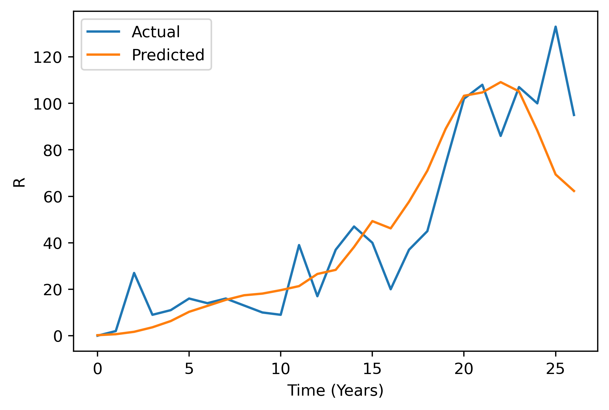
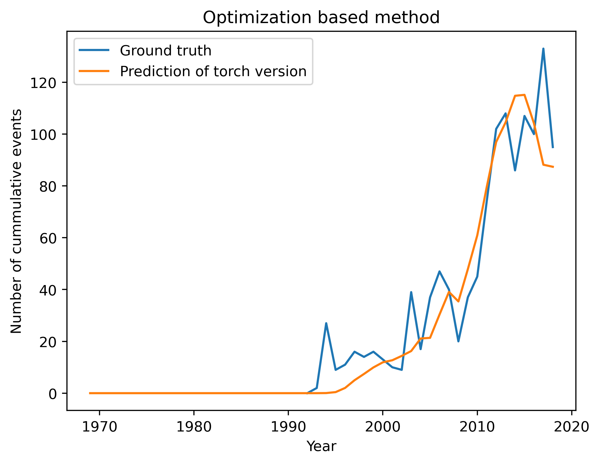

# Groningen Seismicity

## Particle Filter method

## Optimization method
**Gaussian likelihood**
Recovered parameters: 
r: 9.53e-6, 
t_a: 1740, 
Ds_c: 0.34, 
Asigma: 4.47e-3

**Laplacian likelihood**
Recovered parameters: 
r: 1.2e-5, 
t_a: 2088, 
Ds_c: 0.279, 
Asigma: 1.011e-2

## MCMC

