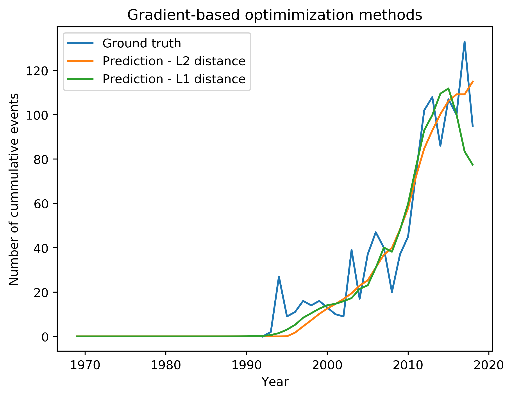

# Groningen Seismicity

## Particle Filter method

## Optimization method
**Gaussian likelihood**
Recovered parameters: 
r: 8.017e-6, 
t_a: 15178, 
Ds_c: 0.374, 
Asigma: 1.31e-3

**Laplacian likelihood**
Recovered parameters: 
r: 1.2e-5, 
t_a: 20888, 
Ds_c: 0.279, 
Asigma: 1.011e-2

## MCMC

